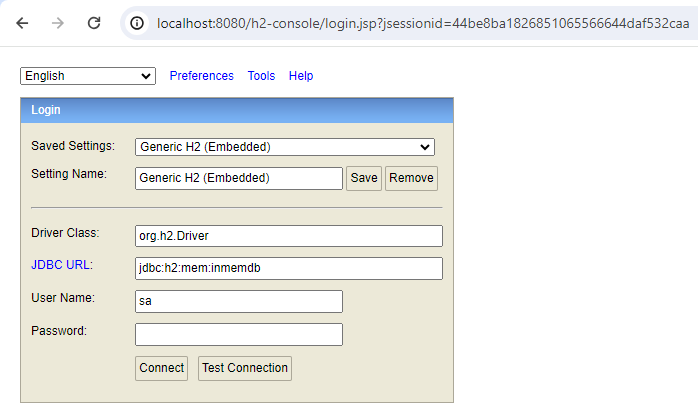
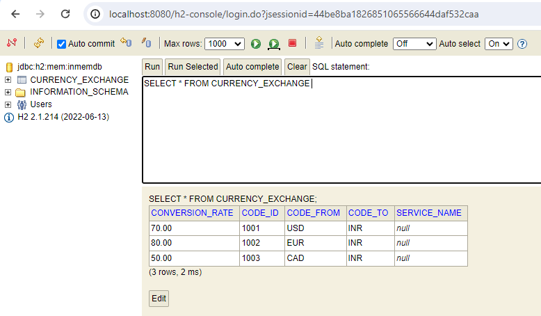

# currency-exchange-service
Currency Exchange Service project using Spring Boot - 03.Nov.2023

# Usage
URL: http://localhost:8080/currency-exchange/from/CAD/to/INR

Sample Response:

<code>
{
"codeId": 1003,
"codeFrom": "CAD",
"codeTo": "INR",
"conversionRate": 50,
"serviceName": "currency-exchange-service"
}
</code>

Other URLs:

http://localhost:8080/currency-exchange/from/USD/to/INR

http://localhost:8080/currency-exchange/from/EUR/to/INR

http://localhost:8080/currency-exchange/from/AUD/to/INR

# Data base
In memory Database - H2

Console: http://localhost:8080/h2-console

